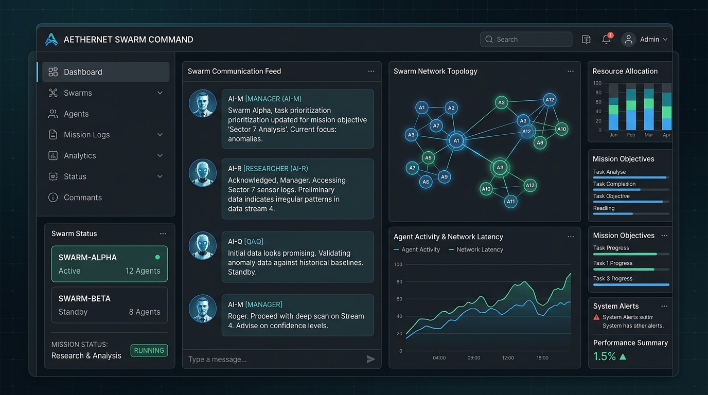

# Autonomous AI Swarm



## Multi-Agent Architecture
This project implements an Autonomous AI Swarm - a team of specialized AI agents that communicate in real-time to solve complex tasks. 

## Real-time WebSocket Communication
Agents communicate over a WebSocket message bus. Users observe the swarm's activity live through the Command Center dashboard.

## Strict Agent Boundaries (Permission Matrix)
The core of this system is the **Permission Matrix**. It enforces boundaries on what each agent role (Manager, Researcher, QA) can and cannot do, ensuring data boundaries and resilience against hallucinated capabilities.

## Fault-Tolerant Consensus Protocol
The Manager delegates, the Researcher executes, and the QA reviews. If QA rejects an output, a feedback loop is triggered, enabling self-correction.

## Live Observation Dashboard
A React + TypeScript frontend provides a real-time observation deck for the active swarm.

### Architecture
```
Manager --> delegates --> Researcher
Researcher --> drafts --> QA
QA --> reviews --> Manager (if passed)
```

## Setup
1. `cp .env.example .env` and add your keys.
2. `docker-compose up --build`
3. Access frontend at `http://localhost`, backend API at `http://localhost:8000`
